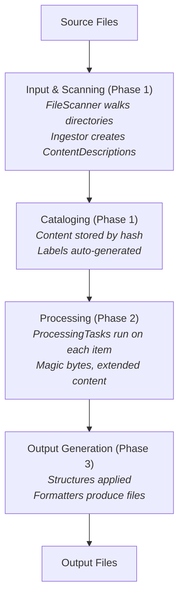

# Processing Pipeline

Indoctrinate processes content through a multi-stage pipeline. Each stage is handled by a dedicated Fable service, and the stages execute sequentially through the Anticipate async pattern.

## Pipeline Stages

## Services

| Service | Role | Phase |
|---------|------|-------|
| `IndoctrinateServiceInput` | Coordinates scanning and ingestion | 1 |
| `IndoctrinateFileScanner` | Recursive directory traversal | 1 |
| `IndoctrinateIngestor` | Creates content descriptions | 1 |
| `IndoctrinateServiceCatalog` | Stores and filters content | 1 |
| `IndoctrinateServiceProcessor` | Runs processing tasks | 2 |
| `IndoctrinateServiceOutput` | Generates formatted output | 3 |

## Detailed Stage Documentation

- [Input & Scanning](pipeline/input.md) - File discovery, content description creation, and label generation
- [Processing Tasks](pipeline/processing.md) - Content analysis and enrichment
- [Output & Formatting](pipeline/output.md) - Structure-driven output generation
